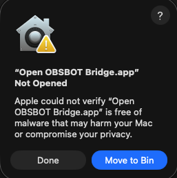
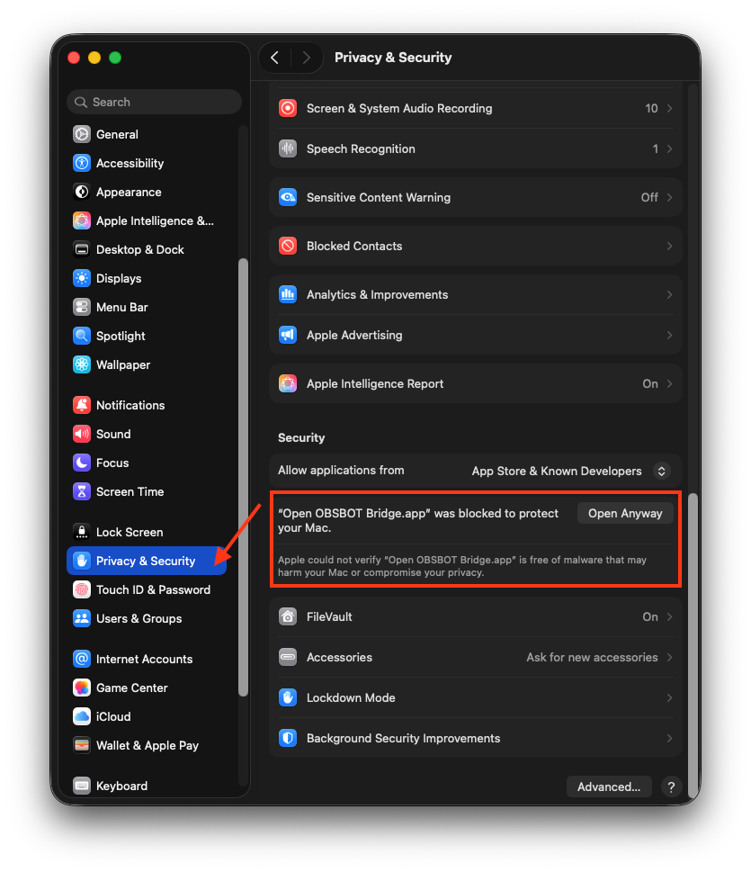
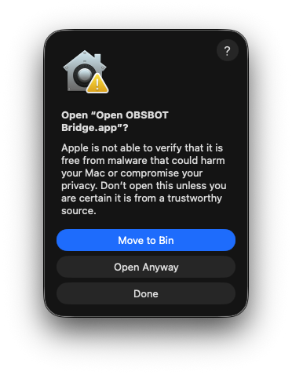
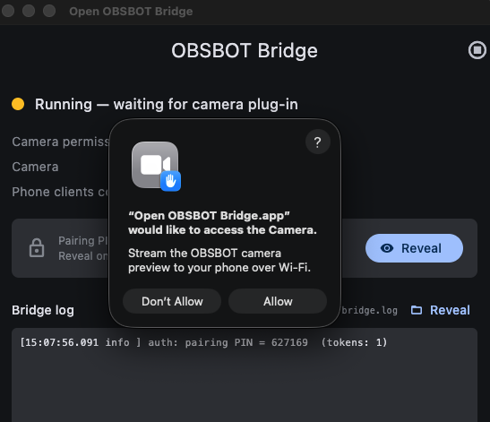
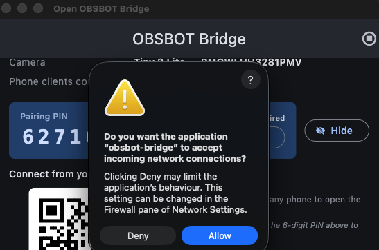

# Open OBSBOT Remote

Open OBSBOT Remote is a phone and browser remote for OBSBOT cameras.

It lets a phone, tablet, or laptop on the same local network control a USB-connected OBSBOT camera: pan, tilt, zoom, recall presets, adjust image settings, run saved timed sequences, and view a live MJPEG preview. The bridge runs locally on the computer connected to the camera. No cloud service or account is involved.

> **Just want to install it?** → [Skip to macOS Installation ↓](#install-the-macos-release)

## Current Status

This project is usable today for the tested camera path. The macOS release artifact is an ad-hoc signed `.app` ZIP for Apple Silicon Macs.

- Tested camera: OBSBOT Tiny 2 Lite.
- Bridge host: macOS with Apple Silicon.
- Phone remote: Web, Android, and iOS Flutter clients are present. The web client is the easiest path because it is served by the bridge.
- Distribution: GitHub Release ZIP for macOS, plus source builds for developers.
- Firmware updates still require OBSBOT Center.

## What You Get

| App                | Purpose                                                                                                                                                                            |
| ------------------ | ---------------------------------------------------------------------------------------------------------------------------------------------------------------------------------- |
| Open OBSBOT Bridge | macOS app that talks to the camera over USB, exposes a local WebSocket API on `:8765`, serves the web remote at `http://<computer-ip>:8765/`, and serves MJPEG preview on `:8766`. |
| Open OBSBOT Remote | Flutter phone/web controller for presets, PTZ, zoom, image controls, AI mode, and sequences.                                                                                       |

```
Phone / browser
  |
  |  local Wi-Fi, JSON WebSocket + PIN token
  v
Open OBSBOT Bridge on the camera computer
  |
  |  USB via OBSBOT libdev SDK
  v
OBSBOT camera
```

## Features

### Camera control

- Live MJPEG preview over the LAN with an optional on-frame grid overlay (rule-of-thirds, centre crosshair, attitude indicator, live Pan / Tilt readout).
- PTZ joystick (analog drag with vertical zoom slider) plus an 8-way hold-button pad for users who prefer discrete input.
- Absolute angle moves, velocity moves, stop, and recenter.
- Zoom with the camera-reported min and max range (1.0x to 2.0x on Tiny 2 Lite).
- Six camera presets (P1 to P6) inlined directly on the Joystick and Buttons tabs so you can save or recall while still holding the gimbal control. Long-press a preset card for Save / Recall instantly / Rename.
- **Pick how long every move takes**: a chip strip at the bottom of each tab lets you choose Instant, 1 sec, 5 sec, 15 sec, 30 sec, 1 min, 3 min, or 5 min. The bridge runs an ease-in-out motion planner so a 30-second pan looks like a cinema-grade slow pan, not a stutter.
- Saved timed sequences with Once / Forward loop / Ping-pong loop modes. Inline timeline editor with drag-to-reorder steps; sequence keeps running if the phone disconnects.

### Image controls

- HDR toggle (with the 3-second firmware debounce baked in).
- View FOV segmented control: Wide (86 deg), Normal (78 deg), Narrow (65 deg).
- Auto-track: Off / Person / Group (the AI work mode, in plain language).
- Brightness, Contrast, Saturation, Sharpness sliders (0 to 100), each with a single-tap reset to default.
- Face AE, Face focus, Horizontal flip toggles.
- Exposure mode (Auto / Manual) plus EV bias slider (best-effort on Tiny 2 Lite: the SDK tags exposure as "tail air"; the bridge attempts the call and the UI greys it out if the firmware rejects).
- Anti-flicker: Off / 50 Hz / 60 Hz.
- White balance: Auto toggle plus Temperature slider (2800 to 6500 K) when Auto is off.
- Per-section Reset buttons next to each header on the Image tab, matching the OBSBOT Center workflow.

### Bridge app

- macOS menubar tray icon (first-party `NSStatusItem`, v1.2.1+) with live status shown in the tooltip. Closing the window hides it instead of quitting, so the bridge keeps running quietly during a livestream.
- **Hybrid dock visibility**: the dock icon follows the main window  -  closing the window hides the dock icon too, showing the window brings it back. No persistent "menubar-only" setting needed (toggle "Start hidden in menubar" if you want the bridge to boot directly into the menubar; the window still force-shows the first time so you can see the pairing PIN).
- Tray menu shows the pairing PIN inline + a "Copy PIN to clipboard" item. Also: Show PIN + QR in main window, Show main window, Open log file, Restart bridge subprocess, Quit. Version line at the top.
- PIN pairing with long-lived bearer tokens. Tokens gate WebSocket commands and MJPEG preview URLs.
- Bridge auto-restart and single-instance enforcement.
- Stable subprocess code signature (`com.harksingh.obsbotbridge.helper`) so the camera permission grant survives rebuilds.
- Logs at `~/Library/Logs/Open OBSBOT Bridge/bridge.log`.

### Remote UI

- Three-tab layout in advanced mode (Joystick / Buttons / Image), plus a Simple mode for one-handed preset operation.
- Sleep and Wake quick actions on every tab (top of the control area, in the same place on Joystick and Buttons so muscle memory carries over).
- OBSBOT-brand red accent on a near-black surface for low-light operation.

## Known Limits

- The Tiny 2 Lite path is the only hardware path tested end to end.
- The shipped bridge target is macOS only today. The SDK includes other platform binaries, but Windows and Linux packaging are not wired yet.
- The macOS release ZIP bundles OBSBOT's runtime `libdev.dylib`; the SDK headers/samples are not committed to git.
- Public macOS ZIPs should be Developer ID signed and notarized. If no Developer ID certificate is installed locally, the packaging script falls back to ad-hoc signing for development builds.
- There is no TLS. Keep the bridge on trusted LANs and do not port-forward ports `8765` or `8766`.
- Native app store distribution is not set up. Use the web remote or build native clients yourself.

## Install The macOS Release

### Step 1 - Download & open the app

1. Download `Open-OBSBOT-Bridge-macOS-arm64-v<version>.zip` from the [latest release page](https://github.com/0xharkirat/open-obsbot-remote/releases/latest).
2. Double-click the ZIP to unzip it.
3. Drag `Open OBSBOT Bridge.app` to your **Applications** folder.
4. (Optional) Quit **OBSBOT Center** if it is running - both apps compete for the same camera endpoint.
5. Plug the OBSBOT camera into the Mac over USB.
6. Double-click **Open OBSBOT Bridge** in Applications.

macOS will block it with the message _"Open OBSBOT Bridge.app" Not Opened_. This happens because the app is not notarized through Apple's paid developer programme. **Click Done - do not click Move to Bin.**



### Step 2 - Allow the app in Privacy & Security

Open **System Settings → Privacy & Security** and scroll down to the **Security** section. You will see:

> _"Open OBSBOT Bridge.app" was blocked to protect your Mac._

Click **Open Anyway**.



### Step 3 - Confirm open

macOS asks one more time. Click **Open Anyway** (not Move to Bin).



You may be asked for your Mac password. Enter it to continue. The app will open. You only need to do steps 1 to 3 once.

### Step 4 - Allow Camera access

When the app launches it will ask for Camera access. Click **Allow**.



### Step 5 - Allow network connections

macOS Firewall will ask if `obsbot-bridge` can accept incoming connections. Click **Allow**.



### Step 6 - Connect your phone

In the bridge window, click **Reveal** to show the pairing PIN and QR code. On any phone or laptop on the same Wi-Fi:

- Scan the QR code, **or**
- Open `http://<your-mac-ip>:8765/` in a browser.

Enter the 6-digit PIN once. The remote saves a token - future connects are automatic.

The release ZIP includes the bridge app, the C++ bridge subprocess, the Flutter web remote, and the OBSBOT SDK runtime dylib. It does not include the full SDK source.

If preview does not appear, check macOS Camera permission and the bridge log at `~/Library/Logs/Open OBSBOT Bridge/bridge.log`.

## Build From Source

Use this path when no release ZIP is available, when you want to develop, or when you need to rebuild the app yourself.

### 1. Install Tools

On the macOS bridge host:

```bash
xcode-select --install
brew install cmake asio
```

Install Flutter stable and confirm it works:

```bash
flutter doctor
```

The build script expects Flutter to support macOS desktop and web builds.

### 2. Clone The Repo

Use the clone URL you have access to:

```bash
git clone <repo-url>
cd open-obsbot-remote
```

### 3. Add The OBSBOT SDK

The OBSBOT SDK is not checked into git. Request the Camera SDK from OBSBOT, unzip it, and place it here:

```text
third_party/obsbot-sdk/
```

The required files include:

```text
third_party/obsbot-sdk/include/dev/dev.hpp
third_party/obsbot-sdk/include/dev/devs.hpp
third_party/obsbot-sdk/macos/arm64-release/libdev.dylib
```

Verify the SDK layout:

```bash
./scripts/verify-sdk.sh
```

More detail: [docs/GETTING_THE_SDK.md](docs/GETTING_THE_SDK.md).

### 4. Build The Bridge App

From the repo root:

```bash
./scripts/build-bridge-mac.sh
```

The script does five things:

1. Builds `apps/bridge_cpp/obsbot-bridge` with CMake.
2. Builds the Flutter web remote from `apps/rc/`.
3. Builds the Flutter macOS bridge shell from `apps/bridge/`.
4. Copies `obsbot-bridge`, `libdev.dylib`, and web assets into the `.app`.
5. Ad-hoc signs the bundle so the subprocess can inherit camera permission.

Output:

```text
apps/bridge/build/macos/Build/Products/Release/Open OBSBOT Bridge.app
```

### 5. Launch

```bash
open "apps/bridge/build/macos/Build/Products/Release/Open OBSBOT Bridge.app"
```

Then follow the install flow above: allow permissions, reveal the PIN, and open the bridge URL from the controller device.

To create the same ZIP shape used for GitHub Releases:

```bash
./scripts/package-mac-release.sh
```

Output lands in `dist/` and is intentionally gitignored.

### Developer ID Signed Release

For a public macOS release, install a `Developer ID Application` certificate with its private key in your login keychain. Xcode can create this from `Xcode > Settings > Accounts > Manage Certificates`.

Confirm macOS can see it:

```bash
security find-identity -v -p codesigning
```

Create a saved notarization credential once:

```bash
xcrun notarytool store-credentials open-obsbot-notary \
  --apple-id "<apple-id>" \
  --team-id "<team-id>" \
  --password "<app-specific-password>"
```

Then build, Developer ID sign, notarize, staple, ZIP, and checksum:

```bash
NOTARYTOOL_PROFILE=open-obsbot-notary ./scripts/package-mac-release.sh 1.0.0
```

If there are multiple Developer ID identities, pin the one to use:

```bash
SIGN_IDENTITY="Developer ID Application: Example Name (TEAMID)" \
NOTARYTOOL_PROFILE=open-obsbot-notary \
./scripts/package-mac-release.sh 1.0.0
```

## Optional: Build Native Phone Apps

The web remote is usually enough. Native builds are useful for development or sideloading.

```bash
cd apps/rc
flutter build apk --release
flutter build ios --release
flutter build web --release
```

iOS release builds require normal Apple signing setup. The web build is normally produced by `./scripts/build-bridge-mac.sh` and bundled into the bridge app.

## Developer Workflow

Common commands:

```bash
./scripts/verify-sdk.sh
./scripts/build-bridge-mac.sh
flutter analyze apps/rc apps/bridge
```

For C++ bridge-only iteration:

```bash
./run-bridge.sh
```

`run-bridge.sh` starts the bridge directly from the terminal. Terminal must have macOS Camera permission for preview capture to work. For realistic end-user behavior, prefer the `.app` build.

Useful paths:

| Path                   | Purpose                                                                                            |
| ---------------------- | -------------------------------------------------------------------------------------------------- |
| `apps/bridge_cpp/`     | C++ bridge using OBSBOT `libdev`, Crow WebSocket/static HTTP, and a small BSD-socket MJPEG server. |
| `apps/bridge/`         | Flutter macOS wrapper app that supervises the C++ subprocess.                                      |
| `apps/rc/`             | Flutter remote for web, Android, and iOS.                                                          |
| `docs/PROTOCOL.md`     | WebSocket and pairing protocol.                                                                    |
| `docs/ARCHITECTURE.md` | Runtime architecture and process boundaries.                                                       |
| `docs/RUN.md`          | Manual test and troubleshooting guide.                                                             |

Persisted runtime files:

| File                                                              | Purpose                        |
| ----------------------------------------------------------------- | ------------------------------ |
| `~/Library/Logs/Open OBSBOT Bridge/bridge.log`                    | Bridge and SDK logs.           |
| `~/Library/Application Support/Open OBSBOT Bridge/auth.json`      | Pairing PIN and issued tokens. |
| `~/Library/Application Support/Open OBSBOT Bridge/sequence.json`  | Last active sequence.          |
| `~/Library/Application Support/Open OBSBOT Bridge/sequences.json` | Saved sequence library.        |

## Troubleshooting

| Symptom                              | What to check                                                                                                                         |
| ------------------------------------ | ------------------------------------------------------------------------------------------------------------------------------------- |
| Phone cannot connect                 | Phone and bridge host must be on the same LAN. Check the bridge URL shown in the app. VPNs and guest Wi-Fi often block local devices. |
| Preview is blank                     | Confirm macOS Camera permission for Open OBSBOT Bridge. Reopen the app after granting permission.                                     |
| PTZ commands fail with `device_busy` | Quit OBSBOT Center and any other app controlling the camera, then restart the bridge.                                                 |
| Build cannot find SDK                | Run `./scripts/verify-sdk.sh` and fix the `third_party/obsbot-sdk/` layout.                                                           |
| Web app looks stale                  | Use the cache-clear menu in the remote, or reload the browser after restarting the bridge.                                            |
| Camera is not detected               | Try another USB cable/port and wait for the camera boot sequence to finish.                                                           |

## Security

The bridge is designed for trusted local networks. Pairing uses a 6-digit PIN and then a 32-byte bearer token. The MJPEG preview requires the token as `?t=<token>`.

Do not expose the bridge to the public internet. See [SECURITY.md](SECURITY.md) for the threat model and current hardening gaps.

## Camera Compatibility

See [docs/CAMERAS.md](docs/CAMERAS.md).

The current implementation is intentionally centered on the tested OBSBOT Tiny 2 Lite path. Other OBSBOT models should be possible because the SDK exposes broad camera support, but each model needs real hardware validation before it should be listed as supported.

## Roadmap

_(Items marked [Hark] are scoped for the next development session.)_

### [Hark] Linux support

- Replace `video_capture.mm` (AVFoundation) with a `video_capture_linux.cpp` using V4L2 for MJPEG capture.
- Wire `third_party/obsbot-sdk/linux/` lib paths into `CMakeLists.txt` (`.so` binaries are already present).
- Add Flutter Linux target to `apps/bridge/` (`flutter create --platforms=linux`).
- Make `bridge_supervisor.dart` conditional - macOS-only calls (`tccutil`, TCC, codesign) must be guarded.
- Write `scripts/build-bridge-linux.sh` and `scripts/package-linux-release.sh`.
- Test using UTM (free macOS VM app at https://mac.getutm.app) with USB passthrough to an ARM Ubuntu VM.

### [Hark] Windows support

- Replace `video_capture.mm` with `video_capture_win.cpp` using Windows Media Foundation for capture.
- Wire `third_party/obsbot-sdk/windows/win64-release/` (`.dll`/`.lib` already present) into `CMakeLists.txt`.
- Add Flutter Windows target to `apps/bridge/`.
- Conditional supervisor code for Windows paths (`%APPDATA%`, etc.).
- Bundle `libdev.dll` + `w32-pthreads.dll` alongside the `.exe` in the release.
- Test using UTM ARM Windows 11 evaluation image with USB passthrough.

### Future

- Notarize macOS release (requires paid Apple Developer account).
- Native iOS/Android phone app on app stores.
- Firmware update support (currently requires OBSBOT Center).
- Multi-camera support.

## License

| Component                  | License                                                                         |
| -------------------------- | ------------------------------------------------------------------------------- |
| Code in this repository    | Apache 2.0. See [LICENSE](LICENSE).                                             |
| OBSBOT SDK headers/samples | Not committed to git. Developers obtain their own local copy from OBSBOT.       |
| OBSBOT SDK runtime dylib   | Bundled in macOS release artifacts so the app runs without a local SDK install. |

Check OBSBOT's SDK terms before publishing release assets that include `libdev.dylib`.

## Contributing

See [CONTRIBUTING.md](CONTRIBUTING.md).
